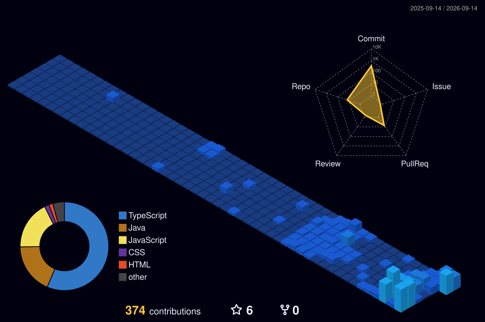

  
  

 

<table align="center" width="100%">
  <tr>
    <td width="50%" valign="top">
      <h3 align="center">👨‍💻 <code>sys.info</code></h3>
<pre><code class="language-java">public class Developer {
    public static void main(String[] args) {
        String name = "Gopal Maddheshiya";
        String[] core = {"Java", "DSA", "Backend", "AI"};

        System.out.println("Building Scalable Systems.");
        System.out.println("Mastering GenAI & Next.js.");
    }
}
</code></pre>
    </td>
    <td width="50%" valign="top">
      <h3 align="center">🛠️ <code>sys.skills</code></h3>
      

        <a href="https://skillicons.dev">
          
            
          
        </a>
      

    </td>
  </tr>
</table>

 

<h3 align="center">📊 <code>sys.metrics</code></h3>

  
  

  

 

<h3 align="center">🌌 <code>sys.contrib_3d</code></h3>

  

  

